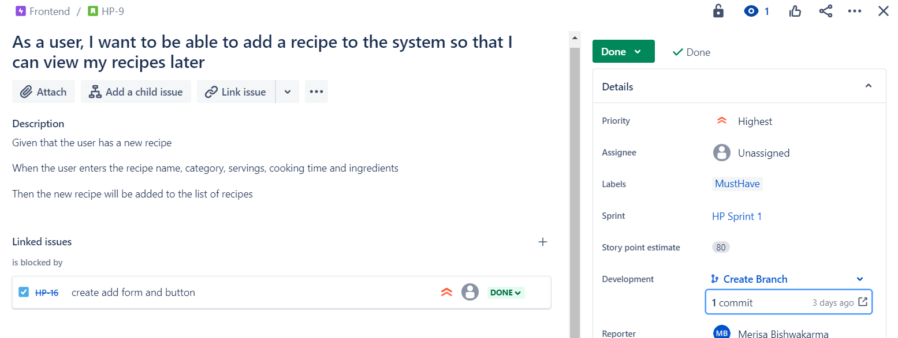
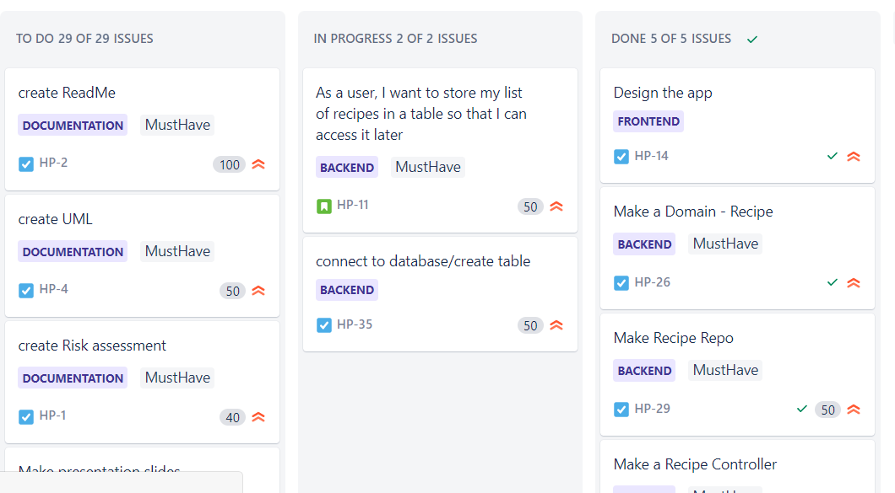
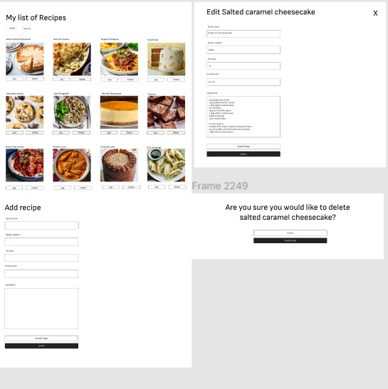
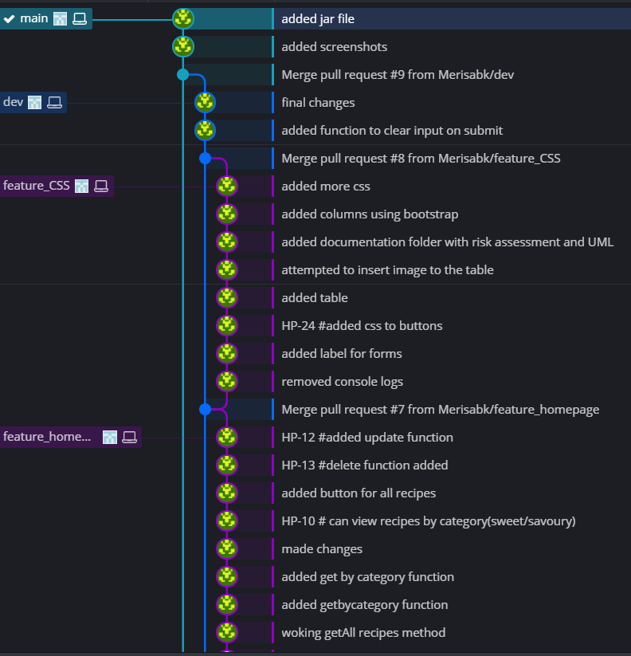
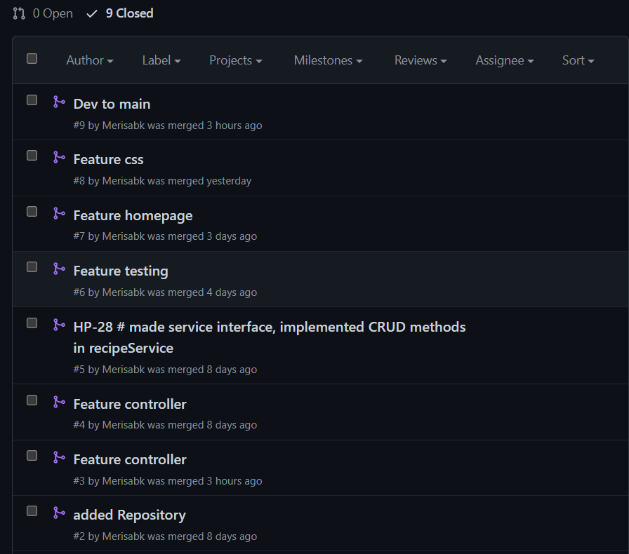

Coverage: 84.2%

# HobbyProject : Recipe App

This is a CRUD application built using the following tools. 
* Jira
* SQL Server
* Java - SpringBoot
* Frontend - HTML, CSS & JavaScript
* Integration Tests: MockMVC
* Version Control: Git

## Overview 

### Planning
#### Jira
I used Jira for my project management. I created four Epics (Documentation, Backend, Frontend and Testing) which included user stories and tasks to represent the work I was doing. I used MosCow prioritisation techinque to determine what needs to be done first. I used story points estimation to estimate the work invovled for each user story. I also added the acceptance creteria to define the expected outcome. 
 

I used Jira board to keep track of the work I was doing, the work that had been completed and work that needed to be done. 

#### Initial design
I used the interface design tool (figma) to come up with an inital design. However, I was not able to stick to this design so I had to simplify my design to get the project working. I would like to keep working on the front-end to make it more user friendly.

#### Git/Github
I used the feature branch model. I branched out from main to dev and from dev to many feature branches. I used separate branch for each feature I worked on. On the feature branch, I made all the changes and pushed my commits and updated feature branch on Github. I linked my git with my jira board to make smart commits.

I used pull requests to merge the feature branch into dev.

